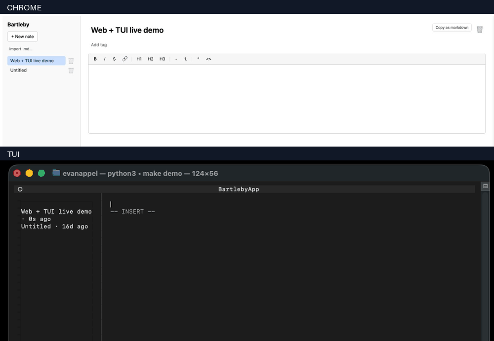

# Bartleby

[](https://github.com/EvanWAppel/bartleby/actions/workflows/ci.yml)

**Two people, one document, two completely different interfaces — a browser and a terminal — typing at the same time and converging with no data loss.**

Bartleby is a self-hosted, real-time collaborative notes app for a small group of friends. It has two first-class clients editing the same note simultaneously: a **SvelteKit web editor** (ProseMirror WYSIWYG) and a **Python Textual terminal UI**. Both are full [Yjs](https://yjs.dev) CRDT peers against a Node + [Hocuspocus](https://tiptap.dev/docs/hocuspocus) collaboration server backed by SQLite.

<p align="center">
  
  <br>
  <em>The web editor (left) and the terminal UI (right) editing the same note. Text typed in one client appears live in the other.</em>
</p>

> The demo GIF lives in [`docs/media/`](docs/media/). If it isn't rendering yet, see that folder's README for how it's recorded.

## Why it's interesting

Real-time collaboration inside a single web app is a solved, if non-trivial, problem. The hard and unusual part here is that **the two collaborating clients share no UI code and no runtime** — one is a browser running `y-prosemirror`, the other is a terminal app running `y-py` (the Python port of Yjs). They are peers on the same CRDT document over the same WebSocket, and neither is privileged. Making a browser and a terminal converge on one rich-text document, byte-for-byte, is a systems problem: schema agreement across a wire, CRDT position stability, and presence/awareness across two entirely different rendering models.

## See it work — the proof is in the test suite

The repo doesn't just claim convergence; it **proves it in CI**. [`web/tests/web-tui-concurrent.test.ts`](web/tests/web-tui-concurrent.test.ts):

1. Boots the full stack (Hocuspocus server + web dev server) and signs in.
2. Opens the note in a **real browser** running `y-prosemirror`.
3. Spawns a **real `y-py` terminal peer** as a subprocess ([`tui/tests/q002_tui_peer.py`](tui/tests/q002_tui_peer.py)), authenticated with the same session JWT, joined to the same Hocuspocus room.
4. Has each side type a distinct marker (`WEBEDIT` / `TUIEDIT`) concurrently.
5. Asserts **both markers converge into both the web DOM and the peer's YDoc.**

That last assertion is the whole ballgame: "no data loss" means each client ends up holding the other's edit. This is not a mock — it's the actual browser and the actual Python peer talking to the actual server.

## How it works

```
┌─────────────┐                      ┌──────────────────────┐
│  Web client │ ── Yjs over WS ────▶ │                      │
│ (ProseMirror│ ◀── REST/JSON ────── │  Bartleby server     │
│  + WYSIWYG) │                      │  (Node + Hocuspocus) │
└─────────────┘                      │                      │
                                     │  SQLite + FTS5       │
┌─────────────┐                      │  Resend (email)      │
│  TUI client │ ── Yjs over WS ────▶ │  Litestream → S3     │
│ (Python +   │ ◀── REST/JSON ────── │                      │
│  textual +  │                      └──────────────────────┘
│  y-py)      │
└─────────────┘
```

- **CRDT source of truth.** A Yjs document (rich-text tree via the y-prosemirror schema) is the canonical state of every note. The server persists it as binary blobs in SQLite and re-derives markdown, tags, and `[[backlinks]]` on every debounced change.
- **Live traffic vs. metadata.** Yjs CRDT updates flow over the Hocuspocus WebSocket; everything else (note list, comments, snapshots, mentions, search, import/export) is a small typed REST/JSON API.
- **Two peers, one schema.** The web client (`y-prosemirror`) and the terminal client (`y-py`) both bind to the same document schema, so a heading typed in the browser is a heading in the terminal.
- **Comments that survive edits.** Inline comments anchor to Yjs `RelativePosition`s, so they track text as it moves; if the anchored span is deleted the comment gracefully becomes an "orphan" with its original quoted text preserved.

For the engineering design record — why a CRDT and not OT, how `y-py` participates as a full peer, and how comment anchoring works — see [`docs/ARCHITECTURE.md`](docs/ARCHITECTURE.md).

## Engineering practices

This is a personal, after-hours project, but it's built to the bar I'd hold professional work to:

- **Strict TypeScript.** `tsconfig` runs `strict: true` with `checkJs`; `svelte-check` reports the web client clean, and there are no `as any` / `: any` / `@ts-ignore` / `eslint-disable` escapes in `web/src`.
- **A typed API layer.** `web/src/lib/api/*` wraps the REST API with explicit request/response interfaces and a dedicated `NotesApiError` class — no swallowed or wrapped errors.
- **Tests across all three components** — 31 web (e2e + unit), 59 server, and 30 TUI test specs — wired into a single [CI workflow](.github/workflows/ci.yml) that runs lint + format-check + typecheck + tests for the server, web, and TUI on every push.
- **Supply-chain hygiene.** GitHub Actions are pinned to commit SHAs and Dependabot is configured.
- **Small, atomic, narratable PRs.** The history is a sequence of numbered, single-purpose PRs ("Workstream T PR 19 (T-013 + T-014): comments pane") you can read one at a time.

Much of this code was built agent-native (Claude Code). That's part of the story, not something hidden: the discipline — strict types, atomic PRs, CI gates, and a convergence proof in the test suite — is the point.

## Repo layout

| Path      | What lives here                                                     |
| --------- | ------------------------------------------------------------------- |
| `server/` | Node + Hocuspocus collaboration server + REST API, SQLite storage.  |
| `web/`    | SvelteKit web client (ProseMirror WYSIWYG editor + y-prosemirror).  |
| `tui/`    | Python + textual + y-py terminal client.                            |
| `ops/`    | Docker Compose, Caddyfile, Litestream config, deploy/restore docs.  |
| `docs/`   | Architecture record, launch checklist, vertical-slice walkthrough.  |

## Running locally

Install everything (root hooks + all three components):

```sh
make install
```

Run the server, web client, and TUI together:

```sh
make dev
```

Or run each component on its own:

```sh
# Server (Node, npm)
cd server && npm install && npm run dev

# Web (SvelteKit)
cd web && npm install && npm run dev

# TUI (Python via uv)
cd tui && uv sync && uv run bartleby-tui
```

There's no Google OAuth needed for local play: the server exposes a test-only dev sign-in when `ALLOW_TEST_SIGN_IN=true`. See [`docs/LAUNCH-CHECKLIST.md`](docs/LAUNCH-CHECKLIST.md) (Part 0) for the exact one-command local setup, and each component's own README for details.

Common developer tasks are `make test`, `make test-e2e`, `make lint`, and `make typecheck` (see `make help`).

## Status

Feature-complete against the [PRD](./PRD.md) and [build plan](./TASKS.md): the web and TUI clients, the collaboration server, auth (Google OAuth for web, device-code for the TUI), comments, snapshots, mentions, search, and import/export all ship. The remaining open work is operational rollout — see [`docs/LAUNCH-CHECKLIST.md`](docs/LAUNCH-CHECKLIST.md).
